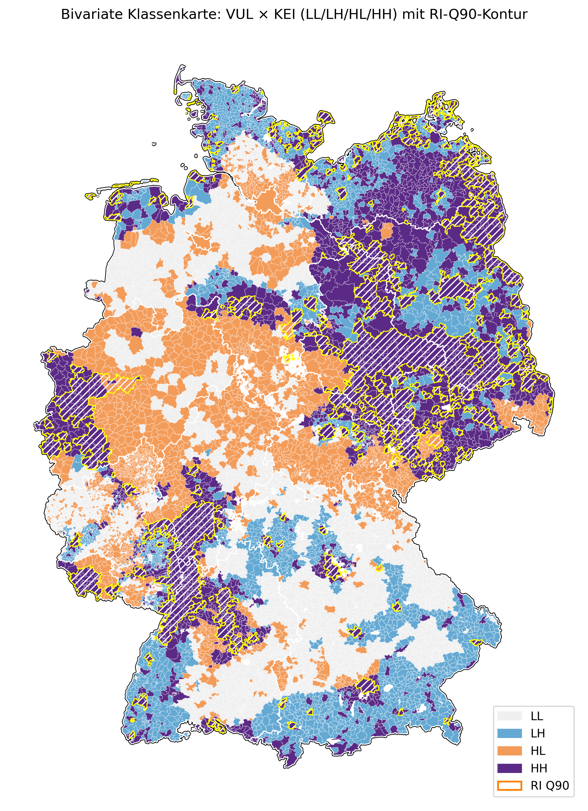

# Abschlussprojekt DSI 05/09/2025

Beteiligte: Carla Novoa Sepúlveda, Katja Linder, Peter Keller

## Thema: Modellierung Risiko Indidikator Wohnen unter Druck in Deutschland im Klimawandel

Wohnen in Deutschland ist sowohl durch ökonomische Einflüsse als auch durch klimatische Änderungen unter Druck geraten. Extremwetterlagen häufen sich, Belastung 
durch unsanierten Bestand und Mieten steigen. Das Jahr 2003 war europaweit ein Extremjahr und hat viele hitzbedingte Tote verursacht. Ausgehend von der Situation
in Frankfurt am Main, wird das Risiko für 2023 analysiert, da für dieses Jahr die meisten Daten verfügbar sind aus Mikrozensus und Deutschlandatlas.

Wir modellieren den Risiko-Index (RI) unter Berücksichtigung zweier Haupteinflüsse
- Klima-Exposition (KEI) als Hazard
- Vulnerabilität des Wohnens (VUL) (getrennt in sozial und baulich) als Mischung aus Exposition und Vulnerabilität

Das Risiko ist dann
```math
RI = KEI \cdot VUL
```
Die resultierende Risikokarte auf Gemeinde-Ebene macht besonders exponierte Gebiete sichtbar. So ist Ostdeutschland großflächig durch Hitze und Dürre betroffen,
aber auch durch großen Bestand von Altbauten, im Vergleich niedrigere Nettohaushaltseinkommen und hohen Anteil über 65 Jähriger, die durch Hitze besonders gefährdet sind.
Im Oberrheingraben macht sich die geographische Lage bemerkbar. Steigende Hitzeeinfluss und Dürre betrifft dabei besonders die Pfalz.
Grosse Teile des westlichen Deutschlands sind insbesondere durch hohe Anteile von Siedlungs- und Verkehrflächen (hohe Urbanisierung) exponiert.


Mittels bivariatem Choropleth, der den Einfluss der beiden Faktoren KEI und VUL sichtbar macht, lassen sich besonders gefährdete Gemeinden auch visuell gut einordnen.
Dazu definiert man LOW als Gebiet, wo der jeweilige Faktor unter seinem Median liegt, und HIGH als Gebiete wo er darüber liegt. So kann man abschätzen, dass
ein Gebiet mit überdurschnittlicher Belastung durch Klima und sozialer/baulicher Vulnerabilität mit ca. 35% Wahrscheinlichkeit zum obersten Dezil der gefährdeten
Gebiete gehört. Die folgende Karte illustiert dies.



---

## Skills

### Datenaufbereitung/Datenvorbereitung/Datenvisualisierung
- Verarbeitung von Rasterdaten mit **Python** aus 4 GB Daten des DWD (HYRAS, ERA5) (Details in Modellierung.docx)
- Mitteln der Daten über die Gemeinden Deutschlands via **GeoPandas**-Bibliothek anhand Geometriedaten des BKG
- Auswahl relevanter Features aus den Daten des Mikrozensus und Deutschland-Atlas (**PowerQuery**, **Excel**)
- Kartenerstellung und Export via GeoPandas in **Jupyter-Notebooks** unter Verwendung eines selbst erstellten **choropleth-pipeline** Pakets
- **Risikomodellierung**

---

## Ansatz

### Hazard (**H**) = **KEI**
Physische Klimatreiber (Hitze, Starkregen, Wind, Dürre)

### Exposure (**E**)
Elemente im Gefährdungsraum (Bevölkerungsdichte, Siedlungs- und Verkehrsflächen)

### Vulnerabilität (*V*)
Anfälligkeit, geringe Resilienz
- 65+ (medizinisch, physiologisch)
- niedriges Einkommen (geringe Anpassungs- resp Bewältigungsfähigkeit)
- Altbauanteil (Fragilität der Bausubstanz, thermische Ineffizienz)

### Allgemeine Risikomodellierung:

```math
R =H\cdot g(E,V)
```
wobei g eine (glatte) Aggregationsfunktion ist. Im einfachsten Fall kann g als Linearkombination von Exposure und Vulnerabilität gewählt werden, d.h.
```math
g(E,V)=\alpha\,E+\beta\,V, \quad \alpha+\beta=1, \alpha,\beta\geq 0
```

